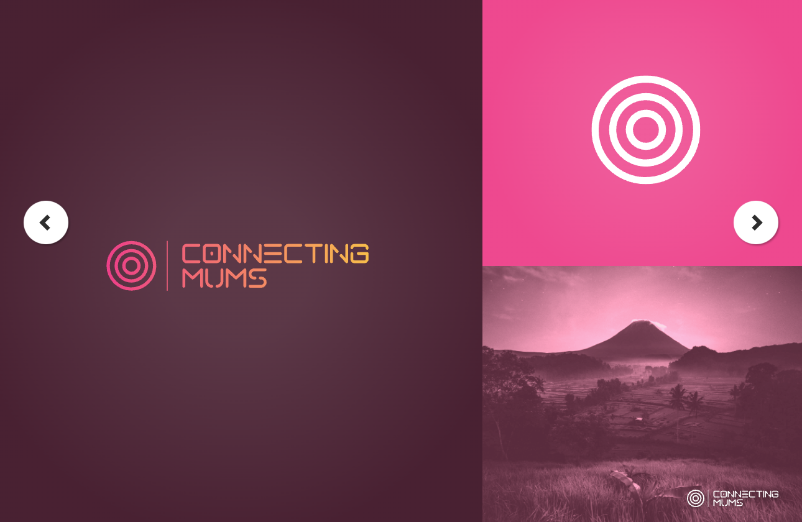
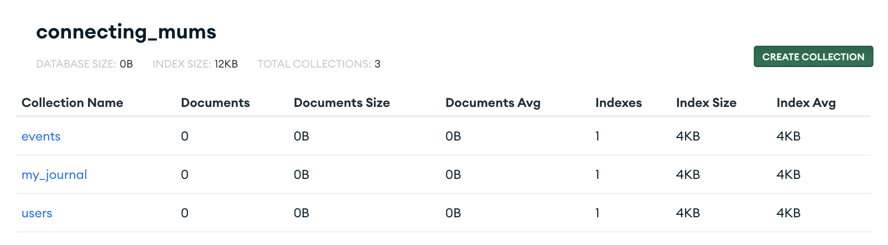
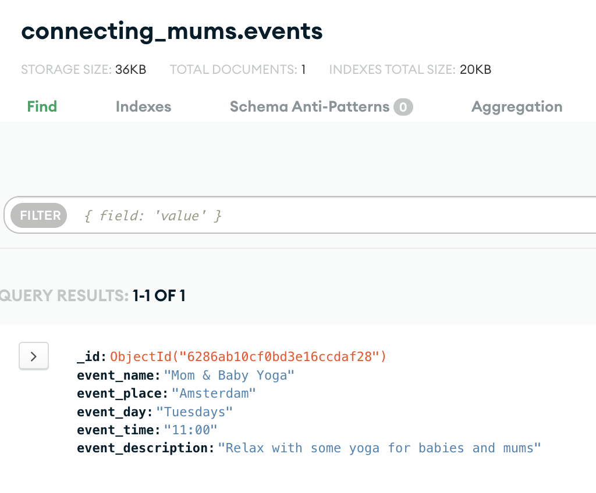

# Connecting-Mums 

[View the live project here](https://connecting-mums.herokuapp.com/)

## User Experience (UX)

### End-user 

1. Goal
- End users for this project are mothers who are looking for practical and emotional support by connecting with other mothers online or in real life
The site owner's goal is to build a community of mothers who shares their small joys and supports each other in difficult times.

2.  Profile: Mothers
- Users are active mothers who want to feel more connected to their motherhood by being connected to a strong community of mothers so they can lift each other up.
- We can identify 2 mental health issue for this community :
    - Perinatal or antenatal anxiety and/or depression if you experience anxiety during pregnancy. 
    - Postnatal anxiety and/or depression if you experience it after giving birth.

a. Identity

We can determine different profiles of mothers that can interact with the site :

- Mother to be (biological): no children and wishes to be mother and can procreate bioligically
- Mother to be (adoption) : no children and wishes to be mother and has to go through adoption
- Perinatal mothers 0 : on a pregnancy stage / first pregnancy
- Perinatal mothers +1 : on a pregnancy stage / has 1 child or more
- Postnatal mothers +1 : not currently pregnant / having their first child
- Postnatal  mothers +2 : not currently pregnant / with at least 2 children
- Sick kids mothers : mothers who are raising kids with diseases / disabilities
- Single mothers : mother who are raising a kid alone
- Baby angel mothers miscarriage : mothers who lost one or more children due to miscarriage
- Baby angel mothers other reasons : mothers who lost one or more children due to other reasons

b. Expectations 

- Mothers want to improve their mental health and approach motherhood in the most positive way. 
- Mothers want to prevent perinatal and/or postnatal anxiety and depression by being surrounded with a strong community of mothers.
- Mothers want to be informed about what to expect around motherhood.

c. Restraints

- Mothers experiencing perinatal and/or postnatal anxiety and depression tend to isolate themselves because they are scared of other mother judgments, specially coming frrom relative and friends.

### User stories

1. First Time Visitor Goals 

* As a mother I want to hear about experiences around motherhood so that I can approach it in a knowledgeable way and be prepared to raise a child, cope with a sick kid or a loss.
* As a mother I want to be able to interact and give support to mothers in needs so that I can feel that I am helping out mothers goign through a difficult time
* As a mother I want to share my own experience so that I have the feeling to contribute in a better future for our children
* As a mother I want learn about good practices in terms of vitamins intakes, excersing, doctor visits etc. so that I can have greats tips on how to take of my mental health during this special time
* As a mother I want to know about organizations / associations that I can reach out so that if I am in need of further helps I can reach to profesionnals.

2. Returning Visitors Goals

* As a mother I want to meet other mothers from the comfort of my home so that I can still connect, have a social life and learn from other mothers remotely.
* As a mother I want to meet other mothers in real life close to my home / in my neighborhood so that my children can have playdates and I can interact in real life
* As a mother I want to organize events about motherhood so that I can meet and inspire other mothers to take care of their mental health.

3. Frequent User Goals

* As a mother I want to have a personal space in which I can daily write my ups and downs so that it helps me be more grateful and cope with difficult times that brings motherhood.
* As a mother I want to be aware of trending topics around motherhood so that I can better help myself and my community
* As a mother I want to be inspired by daily quotes so that it reassures me in my role of mother

### Design

1. Color Scheme

The color scheme chosen  ?  tones as these colors reflects 

The main colour used for this project are as follow : 

* `#BC2065`: dark purple pink as main color to recall feminity and communication

* `#FA8072`: light pink/orange for links to bring dynamism.

* `dark` / `grey` / `white`:  These background/structure colors were chosen to bring profesionalism/serious to the site as it is about mental health and motherhood which are sensitive topics.

2. Typography

The ` Micropolis ` font is the main font used throughout the whole website with `sans-serif` as fallback fonts in a case for any reason, the font isn't being imported into the site correctly. The rounded and dynamic font was chosen to reflect feminity and a dynamic connection aspect to the site.

3. Imagery / Video
Imagery is important in this website to illustrate the importance of the connections between mothers.
* Free images were selected on websites such as 
    - [Pexel](https://www.pexels.com/fr-fr/)
    - [Unsplash](https://unsplash.com/login) 

### Branding research 

[Smashinglogo maker](https://smashinglogo.com/fr/preview?s=ogdps3per-i2vy1iu1m) program was used to generate branding ideas and color scheme.

* Material
    - 
    - 
    - 

* Covers / Hero image 

Through the imagery, the idea is to show connecting mums on several level. On the hero image in the home page it shows the main connection which is between mother and child.
The rest of the image reinforces the idea of connection with other mothers in a virtual or real way.

### Wireframes

* Wireframes - [View](static/wireframes/)

### Database MongoDB

* Connecting mums database 
- events
- my_journal (gratitudes)
- users

* Example of an event document 

## General Features

* The website is called `Connecting Mums`
* The website is structured in 3 main pages : `Home`, `Events`, `My Account`
* The website's pages and different features are responsive on all device sizes. 
* Each page features a responsive header with a navigation bar and a convenient placement of the logo (top left).
* Users can find a sign-up option.
* Users can find a login option if they already created an account.
* There is a footer with copyright information and social media links. 
* The general features of the site are in one space base_template.

### Existing features 

#### Home

* How it works / Purpose
* Quote Generator + Share to twitter
* The Mummy Cheat Codes / Tips 

#### Events

* Search events
* Join events

#### My Account

* Gratitude journal
* Create, edit, delete events
* Register
* Log in / Log out

### Features to implement in the future

- Play button to listening relaxing music while completing the gratitude journal
- Send confirmation e-mail when user confirm participation with link to event
- Add image to an event when creating an event

## Technologies Used 

### Languages Used

* [HTML5](https://en.wikipedia.org/wiki/HTML5)
* [CSS3](https://en.wikipedia.org/wiki/CSS)
* [JavaScript](https://en.wikipedia.org/wiki/JavaScript)
* [Python](https://en.wikipedia.org/wiki/Python_(programming_language))

### Frameworks, Librairies & Programs Used

1. [Git](https://git-scm.com/)
Git was used for version control by utilizing the Gitpod terminal to commit to Git and Push to GitHub.

2. [GitHub](https://github.com/)
GitHub is used to store the projects code after being pushed from Git.

3. [Heroku](https://dashboard.heroku.com/)
Heroku was used to deploy the website

4. [draw.io](https://app.diagrams.net/)
Draw.io was used to create the wireframes during the design process.

5. [Flask](https://en.wikipedia.org/wiki/Flask_(web_framework))
Flask was used as a library to facilitate running all python functons

6. [MongoDB](https://www.mongodb.com/)
MongoDB was used to build databases / collections

7. [Font Awesome](https://fontawesome.com/)
Font Awesome was used on all pages throughout the website to add icons for aesthetic purposes.

8. [StartBootstrap](https://startbootstrap.com/theme/landing-page)
StartBootstrap was used to get a landing page template to build the app

## Testing 

Testing information can be found in the following file [View](testing.md).

## Deployment

### Heroku

The project was deployed to Heroku following the next steps:

1. Create a requirements.txt file using the terminal command `pip freeze > requirements.txt`.
2. Create a Procfile with the terminal command `echo web: python app.py > Procfile`.
3. Proceed with git add and git commit the new requirements and Procfile and then git push the project to GitHub.
4. Create a new app on [Heroku website](https://dashboard.heroku.com/) by clicking the "New" button on your dashboard. Give it a name and set the region to Europe.
5. From the Heroku dashboard of your newly created application, click on "Deploy", "Deployment method" and "select Github".
6. Confirm the linking of the Heroku app to the correct Github repository.
7. In the Heroku dashboard for the application, click on "Settings" > "Reveal Config Vars".
8. Set the following config vars:
IP : 
MONGO_URI : 
PORT : 
SECRET_KEY : 
9. Click on enable deployment.
10. Wait until you get notified a the bottom of the page that your app is deployed and vie the deployment.

## Credits

### Code

1. Page 1 : Home

    * CodePen Home Random Quote Generator [View](https://codepen.io/robersonj/pen/xLOwLG)
    * Quote Generator [View](https://www.freecodecamp.org/news/creating-a-bare-bones-quote-generator-with-javascript-and-html-for-absolute-beginners-5264e1725f08/)
    * JS quote generator [View](https://codepen.io/tag/js-quote-generator)
    * YouTube Player API Reference for iframe Embeds [View](https://developers.google.com/youtube/iframe_api_reference)

2. Page 2 : Events  

    * Love running Code Institute walkthrough project
    * Code Institute Flask Thorin Project

4. Page 3 : Account

    * Journal [View](https://www.youtube.com/watch?v=wNZSeWkp6J0)
    * Gith repo Growth diary [View](https://github.com/kulbinderdio/growthDiary/blob/master/templates/goals.html)
    * 5 minutes journal [View](https://www.intelligentchange.com/products/five-minute-journal-app)

### Content 

* All content was written by the developers (see collaborators section below)
* Color scheme was found on the website Colormind, you can view it [Here](http://colormind.io/)
* Psychological properties of colors were found [Here](http://www.colour-affects.co.uk/psychological-properties-of-colours)
* Psychological properties of fonts were found [Here](https://designmodo.com/font-psychology/)

* Readme.md inspiration models : 
    - Readme.md sample from Code Institute [View](https://github.com/Code-Institute-Solutions/SampleREADME)
    - Readme.md sample from Anna Greaves's portrait artist [View](https://github.com/AJGreaves/portrait-artist/blob/master/README.md)

* Websites benchmark :
    - [Meetup](https://www.meetup.com/)
    - [5 minutes journal](https://www.intelligentchange.com/products/five-minute-journal-app)

### Media

* All photos and images were edited by the developers. 

### FAQ

1. How do users participate to an event on Connecting Mums ?

Users needs to have an account in order to participate to an event on Connecting Mums. Once eregistered they can create an event to help bring awareness and support mothers around the world.

2. I have great ideas, can I contribute in developing and scaling Connecting Mums ?

We will be happy to welcome you onboard to develop the cause. Please contact one the collaborators of this project mentionned below for more information.

### About 

Participation to Hackathon : Getting Connected (May 2022) organized by Code Institute and Trust in Soda

- Highlight the importance of staying connected 
- Bring awareness about Mental Health

### Acknowledgements

Many thanks to : 

- Code Institute and Trust in Soda for organizing this Hackathon : Getting Connected (May 2022)
- Each collaborator of this project for this great coding adventure, celebrating mothers.
- Peer-to-peer support from the Code Institute Slack community.

## Collaborators 

- Carla Buongiorno [view Github](https://github.com/CarlaBuongiorno)
- Martin Oglesby [view Github](https://github.com/EonTAS)
- Florence Mezino [view Github](https://github.com/florencemezino)
- Sorin Andrei [view Github](https://github.com/Sorin05)

## Feedback
If you have any feedback, please reach out to the collaborators of this project 
Thank you!
