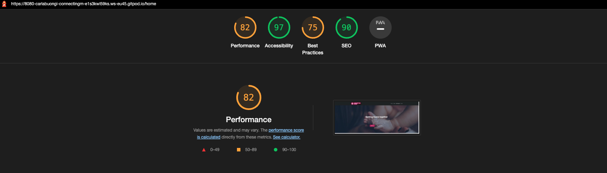

# Connecting Mums

View the live project [Here](https://connecting-mums.herokuapp.com/)

## Testing / Validation 

The W3C Markup Validator and W3C CSS Validator Services were used to validate every page of the project to ensure there were no syntax errors in the project.

- W3C Markup Validator  / Jinja - `TBD`
(to validate Jinja code is to open up a webpage in your app, right click the page, click view source, and copy that code into the W3 HTML validator.)

- W3C CSS Validator - `Success`

- JShint - `TBD`

- Pep8 - `TBD`

- Gitpod report : `TBD`

- Lighthouse : 

## Testing User Stories from the User Experience (UX) Section

Most common paths through the website:
1. `Home > Events > My Account`
2. `Home > My Account > Events`

### As a mother and a new visitor to the website :

* As a mother I want to hear about experiences around motherhood so that I can approach it in a knowledgeable way and be prepared to raise a child, cope with a sick kid or a loss.
    - User can attend events to connect with any other user registered for the event to hear and share stories about their motherhood experience.
    - User would need to have an account to attend to events online or in real life
    - User can search events using a search bar with submit and reset button

* As a mother I want to be able to interact and give support to mothers in needs so that I can feel that I am helping out mothers going through a difficult time
    - User can share inspirational quote related to motherwood to their tweeter community by a simple click.
    - User can generate multiple quotes and share as much as they want
 

* As a mother I want to share my own experience so that I have the feeling to contribute in a better future for our children
    - Registered user can create their own event on the platform for other mothers to attend

* As a mother I want learn about good practices in terms of vitamins intakes, excersing, doctor visits etc. so that I can have greats tips on how to take of my mental health during this special time
    - User can have access to a Mummy cheat codes that includes plenty of tips about taking of hear
    - User has an easy access to relaxing music video, that they can listen while completing their gratitude journal

* As a mother I want to know about organizations / associations that I can reach out so that if I am in need of further helps I can reach to profesionnals.
    - In the footer section, user has access to a support helpline , available 24/7

### As a mother and returning visitor to the website :

* As a mother I want to meet other mothers from the comfort of my home so that I can still connect, have a social life and learn from other mothers remotely.
    - User can register for online event. User can identify thanks to the description if it is a online or a on site event.

* As a mother I want to meet other mothers in real life close to my home / in my neighborhood so that my children can have playdates and I can interact in real life
    - User can attend to real life event. The location is specified in the event description.

* As a mother I want to organize events about motherhood so that I can meet and inspire other mothers to take care of their mental health.
    - Registered user can create their own event on the platform for other mothers to attend.
    - User can see an overview of the events they created and attended in their profile section

### As a mother and frequent visitor to the website :

* As a mother I want to have a personal space in which I can daily write my ups and downs so that it helps me be more grateful and cope with difficult times that brings motherhood.
    - Registered user has access to a gratitude journal in which they can 3 gratitude at a time and as many as they want 

* As a mother I want to be aware of trending topics around motherhood so that I can better help myself and my community
    - User can check the latest event to see what is trending, by clicking the reset button from the search bar.

* As a mother I want to be inspired by daily quotes so that it reassures me in my role of mother
    - User can the "inspire me" button to get different quote and make her reflect and get to a positive thinking.

## Manual (logical) testing of all elements and functionality on every page.

### General

1. Navbar
    - Click on the logo "Connecting Mums" / Check if it redirects to the welcome page
    - Check each link in navbar to verify if navigation links brings back to main page

2. Footer
    - Check social medial links if it works
    - Check collaborators github links if it works

### Home

1. Header / Navigation bar
    - The navbar code is identical on all HTML pages. Testing already completed.

2. Footer
    - The footer code is identical on all HTML pages. Testing already completed.

3. Call to action
    - Confirm Join us and Browse redirects to the correct page
    - Confirm the headings are responsive on all devices 

4. How it works (3 sections)
    - Check if each navigation link for each section redirects to the correct paths
        - Join the community / Sign up
        - Find events / Browse events
        - Self care / My journal 
            - check if my journal gets redirected to log in form if user is not logged in.

5. Quote
    - Go to "Home "from a desktop using logo or Home navigation link
    - Scroll to the quote section
        - check share tweet function and see if the tweet is prefill with the quote
        - check quote generator function and see if it it gets updated with a new random quote

> For every point mentionned above : Repeat verification of functionality and responsiveness on mobile phone and tablet via Developer Tool

### Events

1. Header / Navigation bar
    - Navbar code is identical on all html pages. Testing already completed.

2. Footer
    - Footer code is identical on all html pages. Testing already completed.

3. Content
    - Go to "Events" from a desktop.
    - Check if when using the search bar, it is rendering events
    - Check if all events information are present (date, title, description etc.)
    - Check if the image appear under events.
    - Check if when clicking 'Participate' :
        - it redirects to login if users is not connected
        - text changes to 'you are attending' if user is logged in
        
    - Check that the number of attending persons is updating correctly when joining an event

> Repeat verification of functionality and responsiveness on mobile phone and tablet via Developer Tool

### MyAccount

1. Header / Navigation bar
    - Navbar code is identical on all html pages. Testing already completed.

2. Footer
    - Footer code is identical on all html pages. Testing already completed.

3. Sections to verify
- Go to "My Account" from a desktop
    * Gratitude Journal
        - Check that gratitudes are rendering 
        - Verify that the following information are present in the journal:
            - date
            - 3 gratitudes

    * Attended events
        - Go to event page and click on "I want to attend"
            - Verify that message in the event description is updated to : "already attending"
            - Verify that attended event appears in user profile

    * Create Events
        - Got to profile page and click on create event
        - Check if event appears in events page and in user profile

> Repeat verification of functionality and responsiveness on mobile phone and tablet via Developer Tool

### Log in

1. Header / Navigation bar
    - Navbar code is identical on all html pages. Testing already completed.

2. Footer
    - Footer code is identical on all html pages. Testing already completed.

3. Log in 
    - Go to "Login" from a desktop:
        - Log in successful, there is a flash message welcoming the user.
        - Check if user have access to content from My Account (gratitudes, attended events, created events)
        - Check flash message 
 

### Log out

1. Header / Navigation bar
    - Navbar code is identical on all html pages. Testing already completed.

2. Footer
    - Footer code is identical on all html pages. Testing already completed.

3. Log out 
    - Go to "Logout" from a desktop on the top right corner
        - Click logout
        - Verified that logout flash message appears

### Register

1. Header / Navigation bar
    - Navbar code is identical on all html pages. Testing already completed.

2. Footer
    - Footer code is identical on all html pages. Testing already completed.

3. Sign up buttons 
    - Go to "Sign up" button in the top corner left from a desktop
        - Check buttons redirects to sign up form
        - Check if link "already user" redirect to log in page
        - Check that the flash messages is working
        - Check for an existing user, flash is working : User alread exists

## Further Testing

- Security:
    * Verify security of account / protect user account routing using a different browser (Safari) than the one used to develop this project (Google Chrome)
        - flash message appears : "Please login to complete this request"

- Error handler:
    * Verify if a wrong/unknown url will redirect to 404 error page.
    * Forcing to crash using delete profile function to see 500 error page.

- Other:
    * The Website was tested on Google Chrome, Internet Explorer, Microsoft Edge, and Safari browsers.
    * The website was viewed on a variety of devices such as Desktop, laptops, iPhone7, iPhone 8 & iPhone X (using developer tool)
    * A large amount of testing was done to ensure that all pages were linking correctly.
    * Friends and family members were asked to review the site and documentation to point out any bugs and/or user experience issues.

## Known Bugs

- Making NavBar and footer sticky
- Making site more responsive 

## Feedback

If you have any feedback, please reach out to the developers of the Connecting Mums site :
- Carla Buongiorno [view Github](https://github.com/CarlaBuongiorno)
- Martin Oglesby [view Github](https://github.com/EonTAS)
- Florence Mezino [view Github](https://github.com/florencemezino)
- Sorin Andrei [view Github](https://github.com/Sorin05)
